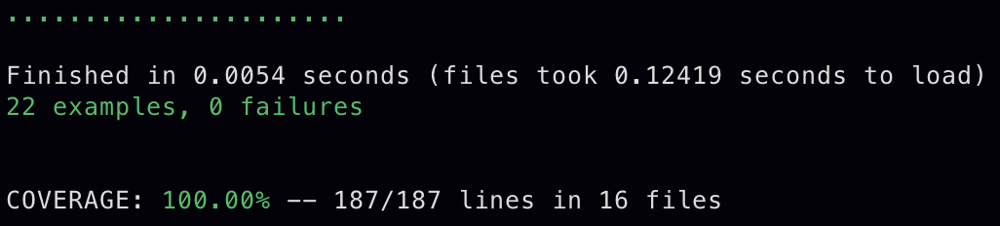

# Gilded Rose Refactoring Challenge
## The Kata
Hi and welcome to team Gilded Rose. As you know, we are a small inn with a prime location in a
prominent city ran by a friendly innkeeper named Allison. We also buy and sell only the finest goods.
Unfortunately, our goods are constantly degrading in quality as they approach their sell by date. We
have a system in place that updates our inventory for us. It was developed by a no-nonsense type named
Leeroy, who has moved on to new adventures. Your task is to add the new feature to our system so that
we can begin selling a new category of items. First an introduction to our system:

	- All items have a SellIn value which denotes the number of days we have to sell the item
	- All items have a Quality value which denotes how valuable the item is
	- At the end of each day our system lowers both values for every item

Pretty simple, right? Well this is where it gets interesting:

	- Once the sell by date has passed, Quality degrades twice as fast
	- The Quality of an item is never negative
	- "Aged Brie" actually increases in Quality the older it gets
	- The Quality of an item is never more than 50
	- "Sulfuras", being a legendary item, never has to be sold or decreases in Quality
	- "Backstage passes", like aged brie, increases in Quality as its SellIn value approaches;
	Quality increases by 2 when there are 10 days or less and by 3 when there are 5 days or less but
	Quality drops to 0 after the concert

We have recently signed a supplier of conjured items. This requires an update to our system:

	- "Conjured" items degrade in Quality twice as fast as normal items

Feel free to make any changes to the UpdateQuality method and add any new code as long as everything
still works correctly. However, do not alter the Item class or Items property as those belong to the
goblin in the corner who will insta-rage and one-shot you as he doesn't believe in shared code
ownership (you can make the UpdateQuality method and Items property static if you like, we'll cover
for you).

Just for clarification, an item can never have its Quality increase above 50, however "Sulfuras" is a
legendary item and as such its Quality is 80 and it never alters.
## How To Use
1. Clone this repo
2. Run ```bundle``` in your terminal
```
bundle install
```
2. Open ```lib/gilded_rose.rb``` in a REPL such as IRB
```
irb -r ./lib/gilded_rose.rb  
```
## Reviewing Tests
Run ```rspec``` in your terminal
```
bundle exec rspec
```
All tests should be green with full test coverage as shown



## Dependencies
Development:
- [Rspec](https://rspec.info/) - Testing framework
- [SimpleCov](https://github.com/colszowka/simplecov) - Code coverage analysis
- [Rubocop](https://rubocop.org/) - Ruby linter

## Approach
1. Converted the kata description into a list of properties for each type of item
2. Created rspec unit tests covering each item type, all of which passed
3. Refactored the ```update_quality``` method within ```gilded_rose.rb``` by creating separate update methods for each type of item, all of which were called in the main ```update_quality``` method
4. Frequently re-ran rspec tests after each significant change to ensure they were still passing
5. Added rspec tests for 'Conjured' items based on the list of item properties
6. Added the corresponding update method to allow the tests to pass
7. Moved each item's update method into its own separate class 
8. Modified ```gilded_rose.rb``` code such that each item would be an instance of it's correspoonding item class, as opposed to an instance of the generic ```Item``` class
9. After noticing a lot of similarity in the code written for each type of item class, the classes were refactored such that:
    - They inhereted functionality from the generic ```Item``` class
    - They included methods from an ```ItemMethods``` module that included frequently used methods such as decrementing the ```sell_in``` value and ensuring the ```quality``` value was never negative (ideally these methods would have been put into the Item class, but it was a requirement that the Item class not be modified)
10. Separated the tests in the ```gilded_rose_spec.rb``` file into separate test files for each type of item
11. Added feature tests for creating and updating an entire list of items within a ```GildedRose``` instance, which passed
### Item Properties
#### Sulfuras (Legendary Item)
```
Does not change in quality
Has a fixed quality value of 80
```
#### All Other Non-Legendary Items
```
Cannot have a quality value higher than 50
Cannot have a negative quality value
```
#### Regular Item
```
Decreases in quality by 1 after each day up until the sell by date
Decreases in quality by 2 after each day past the sell by date  
```
#### Aged Brie
```
Increases in quality by 1 after each day up until the sell by date
Increases in quality by 2 after each day past the sell by date  
```
#### Backstage Pass
```
Increases in quality by 1 after each day up until 10 days before sell by date
Increases in quality by 2 after each day when 10 to 6 days before sell by date
Increases in quality by 3 after each day when 5 days or less before sell by date
Quality is 0 after sell by date
```
#### Conjured Item
```
Decreases in quality by 2 after each day up until the sell by date
Decreases in quality by 4 after each day past the sell by date  
```
